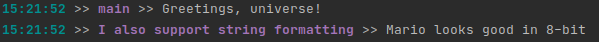
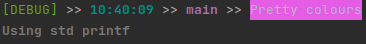

# clogger 
[](https://actions-badge.atrox.dev/RogueSensei/clogger/goto)
[](https://github.com/RogueSensei/clogger/blob/master/LICENSE)

A lightweight functional logging library written in C
## Getting Started
I recommend adding this to your project as a submodule with:
```shell
git submodule add https://github.com/RogueSensei/clogger path/to/clogger
```
Updating is as simple as:
```shell
git submodule update --remote
```
Assuming you're using CMake, you can just add clogger as a submodule to your project:
```cmake
add_subdirectory(path/to/clogger)
```
Then link to your project.
```cmake
target_link_libraries(MyExecutable clogger)
```

Alternatively you can clone/download the repository as normal and compile it yourself (see [Compiling with CMake](#compiling-with-cmake)). Please refer to the official [CMake Tutorial](https://cmake.org/cmake/help/v3.19/guide/tutorial/index.html) for more information on building C/C++ projects with CMake.

### Logging your first message
All the tools you need are contained within a single header: `clogger.h`. Just include it in your C/C++ project and call the standard `clog_message` function, which takes a location (typically the function name) and a message as parameters.

The `message` parameter supports C style formatted strings like a standard `printf()` would. 
```c
#include <clogger.h>

int main()
{
    clog_message(__FUNCTION__, "Greetings, universe!");

    char some_string[3] = "bit";
    int some_num = 8;

    clog_message("I also support string formatting", "Mario looks good in %i-%s", some_num, some_string);

    return 0;
}

```
When the function is called, a simple formatted message is output to the console with colour coding on the timestamp and location.


## Usage
### Builtin logging functions
The library comes with five builtin standard logging functions to distinguish between the 5 typical logging levels.
```c
void clog_info(const char* location, char* message, ...);
void clog_debug(const char* location, char* message, ...);
void clog_warning(const char* location, char* message, ...);
void clog_error(const char* location, char* message, ...);
void clog_fatal(const char* location, char* message, ...);
```
Their usage is the same as the standard `clog_message()` function, but will include the logging level as part of the message.


### Debug mode
In `CLOGGER_DEBUG` mode, `clog_info()` and `clog_debug()` log messages will be logged to the console; this is turned off by default to improve performance. To turn it on you can either:
1. Include a definition for the `CLOGGER_DEBUG` macro
```cmake
if (MY_DEBUG_CONFIG)
    # Preferred
    target_compile_definitions(clogger PUBLIC -DCLOGGER_DEBUG)
endif ()
```
```cmake
if (MY_DEBUG_CONFIG)
    # Dirty but worky
    add_definitions(-DCLOGGER_DEBUG)
endif ()
```
2. Use the builtin `set_clogger_debug()` function
```c
void my_debug_function()
{
    set_clogger_debug(CLogTrue); // or CLOGGER_TRUE
    
    char* message = "Debug mode is turned on";
    clog_info("DEBUG FUNCTION", "%s", message);
}
```
### Tracing functions
You can log a function trace to make debugging easier with the `clog_trace` function.
```c
clog_trace(__FUNCTION__, __FILE__, __LINE__);
```
This will display the traceback in a readable format.


In my case, my IDE makes that link clickable and will take me straight to the line the trace was called on. The most common tracebacks will likely be the line it was called on, so you can use the shorthand macros `CLOGGER_TRACE()` or `CLOGGER_TRACE_LINE()` if you want to specify a line.
```c
CLOGGER_TRACE();
CLOGGER_TRACE_LINE(5);
```
### Did I mention the pretty colours?
You can make use of the macros in `ansi.h` to apply your own colours.
```c
clog_debug(__PRETTY_FUNCTION__, CLOGGER_BG_HMAG"%s", "Pretty colours");
printf(CLOGGER_FG_BOLD_WHT"Using std printf");
```

### Logging to file
```c
// Will return CLOGGER_FALSE/0 on fail
int success = clog_to_file("log.txt", __FUNCTION__, "Egg zample");
```
Currently `clog_to_file` is the only function that doesn't support string formatting
## Compiling with CMake
This is a standalone library so you don't need to install any dependencies. By default, clogger can be built as a static library:
```shell
mkdir build
cd build
cmake ..
cmake --build .
```
To build as a shared library, use the **CLOGGER_SHARED** flag:
```shell
cmake -DCLOGGER_SHARED=ON ..
```
